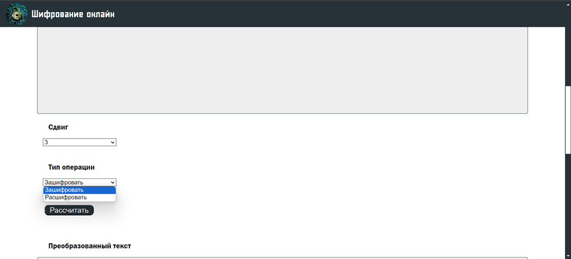

# crypto-site
Учебная практика - сайт на Java Spring Boot Web + Thymeleaf

Разрабатываемое веб-приложение может быть полезно тем, кто хочет изучить историю развития шифрования и некоторые из алгоритмов с особенностями.

Для разработки данного сервиса выбрана технология Java Spring Boot Web, которая позволяет быстро и эффективно создавать веб-приложения на Java. Сервис будет использовать шаблонизатор Thymeleaf для отображения данных на веб-странице.

Разработанное веб-приложение предоставляет пользователям возможность шифрования и расшифрования текстовой информации с использованием различных алгоритмов шифрования.

При запуске приложения, пользователю отображается главная страница, содержащая краткую история криптографии и кнопка, переносящая на выбор алгоритма шифрования. На сайте реализовано четыре алгоритма – шифр Цезаря, шифр AES, шифр RSA и шифр RC4.

</img>

Главная страница

История шифрования

Выбор алгоритма шифрования

При выборе шифра Цезаря пользователь должен ввести текст для кодирования/декодирования, сдвиг вправо по буквам и выбрать тип операции (Зашифровать/Расшифровать).

</img>

Страница шифра Цезаря

В каждом агоритме шифрования необходимо заполнить все поля(если не указано обратное) и нажать на кнопку "Рассчитать".

</img>

Ввод текста, который должен быть закодирован

</img>

Выбор сдвига

</img>

Выбор операции

</img>

Результат преобразования текста

</img>

Обратное действие - Расшифровать

При наличии ошибок при заполнении необходимых полей, а также при неудачной попытке расшифровать текста, будут выводиться ошибки.

</img>

Ошибка заполнения

</img>

Ошибка расшифровки

При выборе шифра AES пользователь должен ввести текст для кодирования/декодирования, размер ключа (128 бит, 192 бита, 256 бит), ключ, IV(необязательно) и выбрать тип операции (Зашифровать/Расшифровать).

При выборе шифра RC4 пользователь должен ввести текст для кодирования/декодирования, ключ и выбрать тип операции (Зашифровать/Расшифровать). 

При выборе шифра RSA пользователь должен ввести текст для кодирования/декодирования, размер ключа, открытый и закрытый ключи и выбрать тип операции (Зашифровать/Расшифровать).

Конец страниц отображает, что сайт был разработан в рамках учебной практики для Высшего Учебного Заведения СПБГУАП. 

</img>
